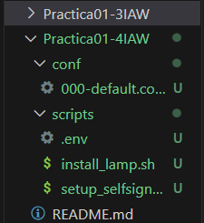
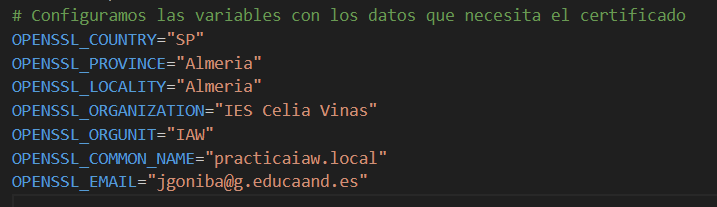
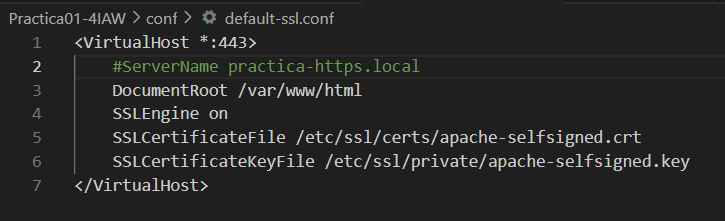
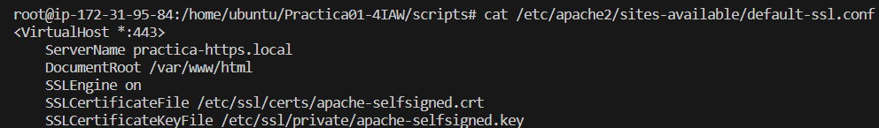
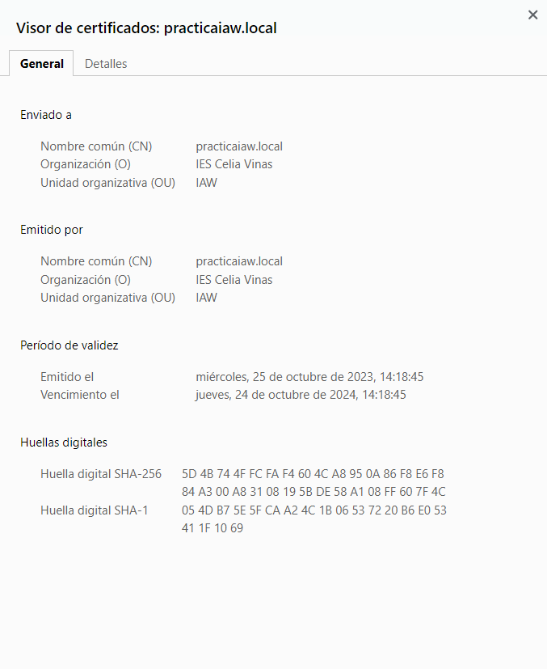
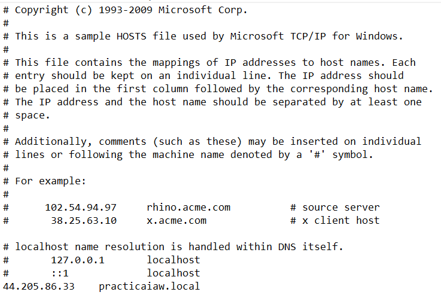

# Practica01-4IAW
Este repositorio es para la Práctica 1 apartado 4 de IAW

## Primer paso.

- Tendremos que copiar una serie de archivos de la otra práctica para el funcionamiento de esta. Tambien tendremos que crear un script nuevo.

- El .env también lo copiamos y pero tiene que estar vacio debido a que deberemos de cambiarlo en un futuro.

- Los directorios que tenemos que tener creados para empezar son los siguientes:

 

## Configuramos el nuevo script junto con las nuevas variables.

- El nuevo script que tenemos que crear se llama *_setup_selfsigned_certificate.sh_*

- Como primer paso tendremos que añadir la siguiente linea para crear un certificado y una clave primaria.

- `sudo openssl req \ `
  `-x509 \ `
  `-nodes \ `
  `-days 365 \ `
  `-newkey rsa:2048 \ `
  `-keyout /etc/ssl/private/apache-selfsigned.key \ `
  `-out /etc/ssl/certs/apache-selfsigned.crt` 

- Y después en *_.env_* añadimos las variables con los nombres que queramos poner:

    

- Si todo funciona correctamente podremos hacer un *_cat_* de las rutas que hemos añadido anteriormente y veremos que esta creada la clave privada y el certificado.

## Configuramos un nuevo archiv .conf

- Tenemos que crear un nuevo archivo de configuración llamado _default-ssl.conf_ donde tendremos que añadir en su interior la siguiente configuración:

- 

- Si esta bien creado, si hacemos un *_cat_* de la ruta nos debería de salir la configuracion de la siguiente manera:

- 

- Si accedemos a nuestra ip de manera remota podemos ver accedemos a nuestra página con una dirección *_http_* pero la misma página nos indica que no es segura. 

- Si pulsamos en el apartado de seguridad donde dice _no es seguro_ encontraremos los diferentes apartados que hemos configurado anteriormente.

- 

## Configuramos nuestro archivo para establecer la conexión siempre desde HTTP.

- Si queremos que la "solicitud" que hagamos a nuestra ip, ya sea desde http o https, siempre nos redirija a https para una conexión segura, tenemos que tener la configuración de nuestro archivo *_000-default.conf_* de la siguiente manera.

  

- El código 301 nos hace una redirección dentro de la configuración para indicar que queremos la conexión por *_https_*

- Estos serian los comandos nuevos que tendriamos que añadir para la configuración.

1. ` # Redirige al puerto 443(HTTPS) `
    `RewriteEngine On `
    `RewriteCond %{HTTPS} off`
    `RewriteRule ^ https://%` 
    `{HTTP_HOST}%{REQUEST_URI} [L,R=301]`

2. Tendremos que añadirlo en las lineas como sale en la captura anterior.

## Cómo configurar desde Windows para acceder con el nombre de dominio que hayamos puesto.

- Desde nuestra ordenador local que en mi caso es _Windows_ para poder acceder tenemos que ir al _explorador de archivos_ y desde ahí ir a la ruta siguiente:

- `c:\Windows\System32\Drivers\etc\hosts`

- Es *MUY IMPORTANTE* editar el siguiente archivo llamado *_host_* desde administrador. En el caso de que no nos deje, podemos hacer lo siguiente.

1. Vamos al archivo de host, pulsamos *_click derecho_* y *_propiedades_*.

2. En el apartado de seguridad, le damos a *_editar_* y en el usuario `/usuarios` del sistema le damos control total.

3. Aplicamos la configuración y aceptamos.

4. Con esta configuración podemos acceder desde nuestro ordenador a la ip pero a través del nombre del dominio y por *_https_*

- El archivo tendrá que quedar de la siguiente manera para que funcione.

  

5. Es importante nada más colocar la ip, tabular y añadir el nombre del domino. Tenemos que estar seguros de que es el mismo nombre que hemos puesto en el archivo *_.env_* que tenemos creado.

